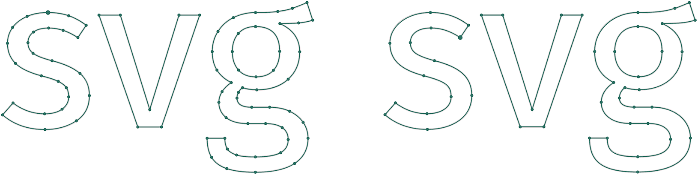

[](https://www.npmjs.com/package/svg-path-simplify)
[](https://www.npmjs.com/package/svg-path-simplify)
[](https://cdn.jsdelivr.net/npm/svg-path-simplify@latest/dist/svg-path-simplify.min.js)
[](https://www.unpkg.com/svg-path-simplify@latest/dist/svg-path-simplify.js)


# svg-path-simplify
Simplify Bézier paths while keeping shape.  

## *Watch the curve, not the file size!*   
While this library reduces SVG markup sizes significantly by removing commands it prioritizes **visual quality** over numeric compression gains.
Unlike most existing approaches (e.g in graphic applications), it checks where simplifications are suitable and stops simplification at the right »point« (literally).

    
*Fira Sans (based on truetype/glyph quadratic commands) converted to cubic Bèziers. Right:Original; Left:optimized*

## Features – what it does
* reduces the number of SVG commands (both Bèziers and lines) by converting/combining adjacent:  
  * Béziers (`C`, `Q`)
  * flat Béziers to Linetos
  * colinear lines (`L`)

* reorders path starting points to replace unnecessary closing linetos by `Z` commands
* optimizes SVG file size by contextually converting to:  
  * shorthand commands (`C` => `S`, `Q` => `T`, `L`=>`H` or `V`)
  * cubics to quadratic Béziers  (only 1 control point)
  * cubic arc-like segments to `A` (elliptic arc)

* adaptive coordinate rounding: small or large details can be auto-detected to find a suitable floating point accuracy without guessing the decimal value (3 decimals may not be the silver bullet=)
* split segments at extremes – only useful for manual editing
* optimize either path data strings or SVG markup code

### Limitations: What it's not
This lib's focus is on path data optimizations. While it also provides some basic cleanup options for entire SVG documents (e.g removal of hidden elements or path merging) – if you need a full blown document optimization better opt for [SVGO](https://github.com/svg/svgo).  


## Usage 

### Browser 

#### Example 1: parse and simplify (using defaults)
```html
<script src="https://cdn.jsdelivr.net/npm/svg-path-simplify@latest/dist/svg-path-simplify.min.js"></script>
```

```js
let pathDataString = 
`
M 57.13 15.5
c 13.28 0 24.53 8.67 28.42 20.65
c 0.94 2.91 1.45 6.01 1.45 9.23
`

// try to simplify
let pathDataOpt = svgPathSimplify(pathDataString);

// simplified pathData
console.log(pathDataOpt)
// returns `M 57.1 15.5c16.5 0 29.9 13.4 29.9 29.9`
```

#### ESM version

```js  
import { svgPathSimplify } from '../dist/svg-path-simplify.esm.min.js'

let pathDataString =
`
M 57.13 15.5
c 13.28 0 24.53 8.67 28.42 20.65
c 0.94 2.91 1.45 6.01 1.45 9.23
`

// try to simplify
let pathDataOpt = svgPathSimplify(pathDataString);

// simplified pathData
console.log(pathDataOpt)
// returns `M 57.1 15.5c16.5 0 29.9 13.4 29.9 29.9`
```

### node.js
Install module via npm:   
```
npm install svg-path-simplify
```
Import:  
``` 
import { svgPathSimplify  } from 'svg-path-simplify';

// use it as in the above examples
let pathDataString =  `M 57.13 15.5c 13.28 0 24.53 8.67 28.42 20.65c 0.94 2.91 1.45 6.01 1.45 9.23`;
let pathDataOpt = svgPathSimplify(pathDataString);

```

### API

``` 
let options = {}
let output = svgPathSimplify(input, options);
```

The first parameter is the SVG input:  
* a path data string – as used in SVG `<path>` element's  `d` attribute
* a polygon string – as used in SVG `<polygon>` element's  `points` attribute
* an entire `<svg>` markup

While svg-path-simplify aims at a convenient config-free usage you can tweak the simplification and output via these options passed as an object.    

| parameter | effect | type | default |
| -- | -- | -- | -- |
| simplifyBezier | main Bézier simplification. When disabled you get the common optimization similar to SVGO (rounding, to all relative and shorthand conversions)  | Boolean | true |
| getObject | whether to return the SVG/pathdata markup directly or a detailed object (containing more info)  | Boolean | true |
| tolerance | increase or decrease tolerance: higher values allow more distortions, lower ones more shape fidelity | Number | 1 |
| optimizeOrder | reorders commands to get more adjacent simplification candidates. Improves optimization efficiency | Boolean | true |
| removeColinear | removes unnecessary zero-length or colinear lineto commands | Boolean | true |
| flatBezierToLinetos | replaces flat Béziers with linetos which also can be stripped via previous colinear removal | Boolean | true |
| revertToQuadratics | replaces cubic Béziers with quadratic (more compact) ones when applicable | Boolean | true |
| keepExtremes | skips simplification accross x/y extrema – improves shape fidelity | Boolean | true |
| keepCorners | skips simplification corners – improves shape fidelity | Boolean | true |
| extrapolateDominant | tries to extrapolate adjacent curves based on dominant larger segment. Effective but adds computational load. Disable it for better performance  | Boolean | true |
| keepInflections | retains commands introducing direction changes – adds complexity but may help for editing in a graphic application | Boolean | false |
| addExtremes | adds commands at x/y extrema – adds complexity but may help for editing in a graphic application | Boolean | false |
| autoAccuracy | calculates a suitable floating point precision for coordinate rounding. Usually rather conservative – decreasing by one decimal should work without significant distortions | Boolean | true |
| decimals | manual floating point rounding precision – overriden when `autoAccuracy` is enabled | Number | 3 |
| minifyD | path data microoptimization: removes recurring command type tokens, whitespace and leading zeroes: 0: maximum optimization; 1: "verbose" dont't omit command type tokes; 2: "beautify" separate each command with new lines (e.g for educational purposes) | Number | 0 |
| quadraticToCubic | converts all quadratic Béziers to cubics – recommended for efficiency | Boolean | true |
| toRelative | converts all commands to relative – reduces file size | Boolean | true |
| toShorthands | converts all commands to shorthand when applicable – reduces file size | Boolean | true |
| arcToCubic | converts elliptic arc `A` commands to cubic approximations – not recommended | Boolean | false |
| removeHidden | removes hidden elements for SVG inputs | Boolean | true |
| mergePaths | concatenates paths into single one – does not respect individual styles! | Boolean | false |


### Example 2: Apply options  
The following example would return a detailed object containing the stringified "normalized" pathdata (all absolute and "longhand" command notation). 

``` 
let options = {
 extrapolateDominant: false,
 decimals: 3,
 toRelative: false,
 toShorthands = false,
 minifyD: 2,
 getObject: true
}

let input = `M717 208c-35 12-74 14-135 14 54 25 82 64 82 117 0 93-68 157-177 157-21 0-40-3-59-9-14 10-22 27-22 43 0 26 20 38 60 38h74c93 0 158 55 158 128 0 90-75 141-217 141-149 0-198-44-198-141h73c0 56 25 77 125 77 97 0 135-23 135-71 0-44-34-66-93-66h-73c-78 0-119-38-119-88 0-30 18-59 51-82-54-28-78-68-78-128 0-93 78-161 178-161 73 1 120-6 152-17 16-6 36-14 60-24zm-235 27c-61 0-96 41-96 103s36 105 98 105 97-39 97-106-33-102-99-102z`;

let simplified = svgPathSimplify(input, options);
let {svg, d, report} = simplified;

console.log(simplified)

/*
// returns 
{
"svg": "",
"d": "M 717 208
C 682 220 643 222 582 222
C 636 247 664 286 664 339
C 664 432 596 496 487 496
C 466 496 447 493 428 487
C 414 497 406 514 406 530
C 406 556 426 568 466 568
L 540 568
C 633 568 698 623 698 696
C 698 786 623 837 481 837
C 332 837 283 793 283 696
L 356 696
C 356 752 381 773 481 773
C 578 773 616 750 616 702
C 616 658 582 636 523 636
L 450 636
C 372 636 331 598 331 548
C 331 518 349 489 382 466
C 328 438 304 398 304 338
C 304 245 382 177 482 177
C 555 178 602 171 634 160
C 650 154 670 146 694 136
Z 
M 482 235
C 421 235 386 276 386 338
C 386 400 422 443 484 443
C 546 443 581 404 581 337
C 581 270 548 235 482 235
Z 
",
 "report": {
  "original": 29,
  "new": 29,
  "saved": 0,
  "compression": 148.46,
  "decimals": 0
 },
 "inputType": "pathDataString",
 "mode": 0
}
*/
```

## Demos
You can easily test this library via the [simplify webapp](https://herrstrietzel.github.io/svg-path-simplify/) or by checking the demo folder. 

* [simple setup IIFE](./demo/simple-iife.html)
* [simple setup esm](./demo/simple-esm.html)  


## Changelog, Updates and rollback
### Changelog
... not much to say at this point

### Rollback
If you encounter any issues with the recent versions you can rollback to a previous version.  
See all versions on 
* [npm](https://www.npmjs.com/package/svg-path-simplify)  
* [jsdelivr](https://www.jsdelivr.com/package/npm/svg-path-simplify)


## Bug reporting
If you found a bug - feel free to file an [issue](https://github.com/herrstrietzel/svg-path-simplify/issues).   
For debugging you may also test your example in the [webapp](https://herrstrietzel.github.io/svg-path-simplify). 
You can also post in the [discussions](https://github.com/herrstrietzel/svg-path-simplify/discussions/) if you have ideas for missing features.


## Related  libraries
* **polygon simplification:** Volodymyr Agafonkin for [»simplify.js«](https://github.com/mourner/simplify-js) 
* **polygon smoothing/curve fitting** [simplify.js](http://paperjs.org/reference/path/#simplify) 

## Other SVG related projects  
* [poly-simplify](https://github.com/herrstrietzel/poly-simplify): Simplify/reduce polylines/polygon vertices in JS
* [svg-getpointatlength](https://github.com/herrstrietzel/svg-getpointatlength): Calculate path lengths, points or angles at lengths based on raw pathdata
* [fix-path-directions](https://github.com/herrstrietzel/fix-path-directions): Correct sub path directions in compound path for apps that don't support fill-rules
* [svg-pathdata-getbbox](https://github.com/herrstrietzel/svg-pathdata-getbbox): Calculate a path bounding box based on its pathdata


## Credits
* [Vitaly Puzrin](https://github.com/puzrin) for [svgpath library](https://github.com/fontello/svgpath) providing for instance a great and customizable [arc-to-cubic approximation](https://github.com/fontello/svgpath/blob/master/lib/a2c.js) – the base for the more accurate arc-to-cubic approximations
* [Jarek Foksa](https://github.com/jarek-foksa) for developping the great [getPathData() polyfill](https://github.com/jarek-foksa/path-data-polyfill) – probably the most productive contributor to the ["new" W3C SVGPathData interface draft](https://svgwg.org/specs/paths/#InterfaceSVGPathData)
* obviously, [Dmitry Baranovskiy](https://github.com/dmitrybaranovskiy) – a lot of these helper functions originate either from Raphaël or snap.svg – or are at least heavily inspired by some helpers from these libraries

